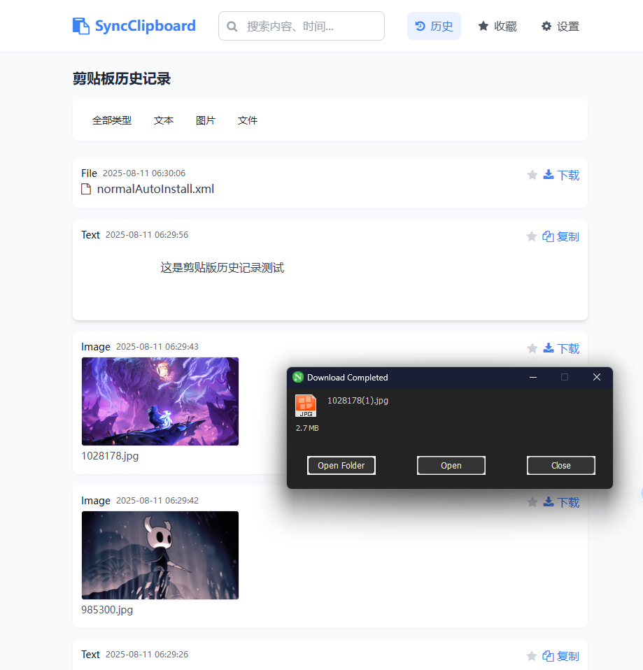
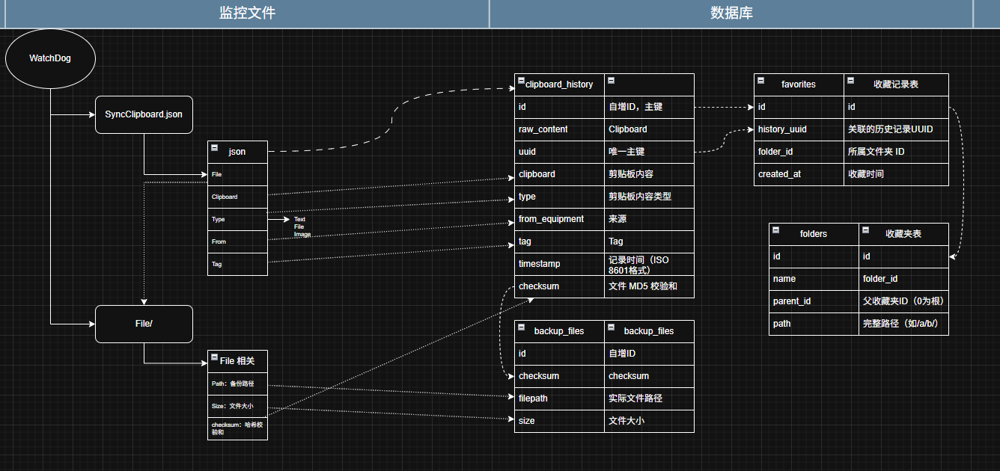

# SyncClipboardWebHistory

[SyncClipboard](https://github.com/Jeric-X/SyncClipboard) 的在线剪贴板


# 警告

基本上只有最基础的功能，通过浏览器展示历史记录，无法进行收藏等一系列操作

# 效果



# 运行
1. SyncClipboard 使用 webdav 同步，将仓库放在 `SyncClipboard.json` 文件相同目录
2. 推荐：打开“自动删除服务器上的临时文件”
3. 安装依赖：
```bash
pip install -r requirements.txt
```
4. 运行脚本
```bash
python3 start.py
```
## 配置文件
[配置文件](config.py)：
```python
class Config:
    # 基本路径配置
    BASE_DIR = os.path.dirname(os.path.abspath(__file__))
    
    # JSON 文件路径
    SYNC_CLIPBOARD_JSON_FILE = "SyncClipboard.json" # 同步文件名
    SYNC_CLIPBOARD_JSON_PATH = os.path.join(BASE_DIR, SYNC_CLIPBOARD_JSON_FILE) # 主同步文件路径
    

    # 数据库配置
    DB_PATH = os.path.join(BASE_DIR, "db", "clipboard_history.db")
    DB_LOG_ENABLED = True  # 是否启用数据库日志

    # 备份配置
    BACKUP_DIR_FOLDER = "backup"  # 当前文件夹下，备份文件夹名称

    BACKUP_DIR = os.path.join(BASE_DIR, BACKUP_DIR_FOLDER)
    
    # 网页配置
    TEMPLATES_DIR = os.path.join(BASE_DIR, "templates")
    STATIC_DIR = os.path.join(BASE_DIR, "static")
    
    # 历史文件删除配置
    MAX_FOLDER_SIZE = "1G"  # 支持格式: "100MB", "2GB", "512KB", "1024B"
    CHECK_INTERVAL = 60  # 检查间隔（秒）
    FOLDER_TO_MONITOR = os.path.join(BASE_DIR, BACKUP_DIR_FOLDER)  # 替换为要监控的文件夹路径，一般和备份文件夹相同
```


# todo

## web
- [x] 历史记录页面
- [ ] 收藏页面
  - [ ] 分组收藏
- [ ] 在线修改设施

## 数据监控
- [x] 监控 `SyncClipboard.json` 文件
- [x] 控制备份文件大小
- [ ] 使用硬链接备份文件

## webdav
- [ ] 添加 webdav 功能，直接启动服务端

## docker
- [ ] 打包 docker

# 开发
## 文件结构

```
.
├── backup/             # 备份文件位置
├── clipboard_history_OneFile.py  # 单文件版本，运行后会生成html页面
├── config.py           # 配置文件   
├── database.py         # 数据库相关函数
├── db
│   └── clipboard_history.db  # 历史数据库
├── file                # 备份文件存储目录
├── history_service.py  # 剪贴板监控部分
├── requirements.txt    # 依赖库
├── start.py            # 启动文件
├── SyncClipboard.json  # SyncClipboard 剪贴板同步文件
├── templates           # web 模板
│   ├── base.html
│   ├── favorites.html
│   ├── index.html
│   └── settings.html
└── web_server.py       # web 服务器
```


## 数据库：

